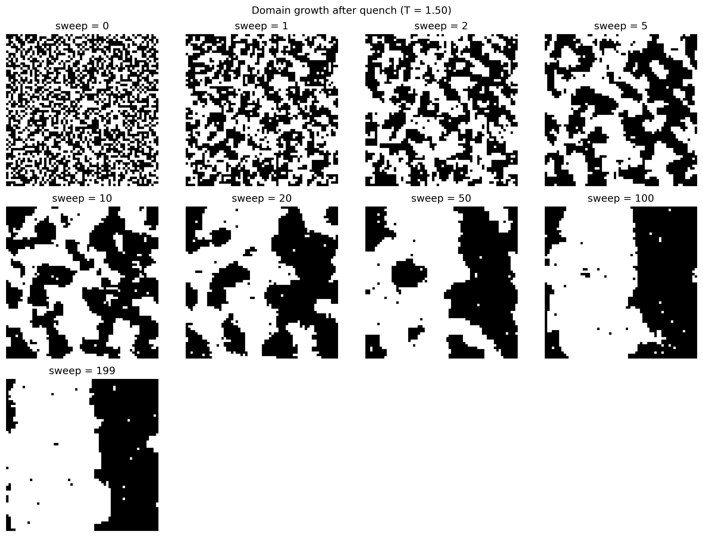

# 2D Ising Model — Domain Growth After a Temperature Quench
**Author:** Ravishankar Hudda  
**Website:** https://rshudda.github.io  
**GitHub:** https://github.com/rshudda  

This repository contains a simple simulation of **domain growth** in the 2D Ising model after a sudden temperature quench.  
The goal is to visualise how large ordered domains develop over time when a disordered high-temperature system is quenched to a low temperature.

This project is part of my computational physics preparation for PhD research in **Statistical Physics** and **Complex Systems**.

---

## 📁 Notebook

### **`ising_quench_simulation.ipynb`**

This notebook includes:

- Random high-temperature initial state  
- Sudden quench to low temperature  
- Metropolis Monte Carlo simulation  
- Snapshots of domain growth at several times  
- Magnetisation vs time  
- Domain-proxy (aligned-neighbour fraction) vs time  

---

## 🖼 Example Outputs

### **Domain-growth snapshots**


### **Magnetisation vs time**


### **Domain proxy vs time**


---

## 🎯 Purpose
This project demonstrates:

- Non-equilibrium dynamics  
- Domain coarsening and emergent order  
- Effects of temperature quench  
- Monte Carlo simulation techniques  

It complements my earlier computational work in statistical and network physics.

---

## 🛠 Requirements

- Python 3  
- numpy  
- matplotlib  
- jupyter  

Install with:

```bash
pip install numpy matplotlib jupyter


📌 Notes
This is a learning-oriented project designed to build intuition for non-equilibrium statistical physics and emergent behavior in complex systems.
